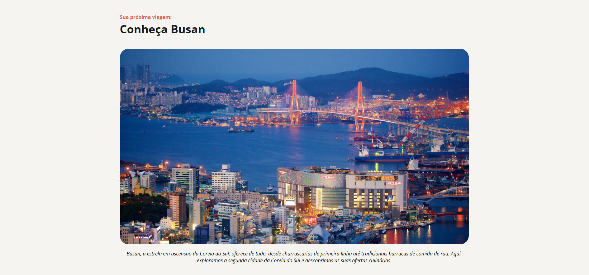
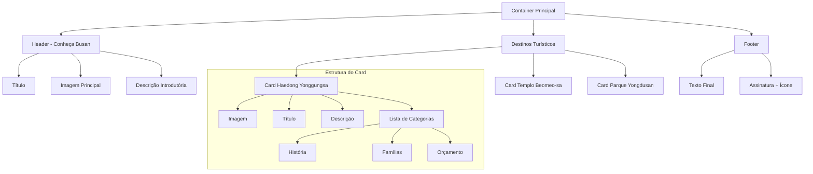
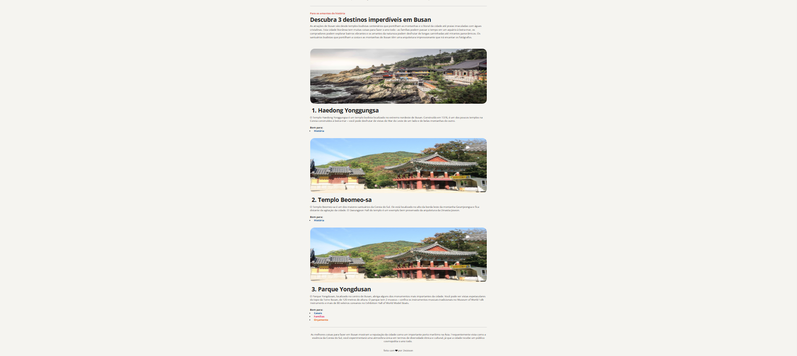

# Local Turístico - Busan Landing Page 🌊

[](https://developer.mozilla.org/pt-BR/docs/Web/HTML)
[](https://developer.mozilla.org/pt-BR/docs/Web/CSS)
[](https://opensource.org/)




Um projeto de landing page dedicado a apresentar as belezas e atrações turísticas de Busan, na Coreia do Sul. O site apresenta uma interface limpa e moderna, focada em destacar os principais pontos turísticos da cidade, especialmente seus templos históricos.

## 🎯 Sobre o Projeto

O projeto foi desenvolvido com HTML e CSS puro, utilizando boas práticas de desenvolvimento web e design responsivo. A estrutura do site foi planejada para proporcionar uma experiência de usuário fluida e informativa, apresentando os principais pontos turísticos de Busan, com foco especial em seus templos históricos e atrações culturais.

## 🛠 Tecnologias Utilizadas

- HTML5
- CSS3
- Google Fonts (Open Sans)

## 🎯 Links do Projeto Funcionando é so clicar
<div align="center">

[](https://www.figma.com/design/1555H6SjqiLA95qgu6g36k/Local-Tur%C3%ADstico?node-id=3-376&t=sUm3asoEzLaIBaCx-1)
[](https://dvizioon.github.io/LOCAL-TURISTICO/)

</div>

## 🔄 Fluxo do Projeto

O projeto segue uma estrutura hierárquica clara, com um container principal que organiza todas as seções. Fluxo normal:



## 🎨 Style Guide

### Cores
```css
/* Background e Divisores */
--background-container: #F5F4F0;
--divisor-container: #D9D9D9;

/* Sistema de Cores para Textos */
--text-primary: #1B1B1B;      /* Títulos principais */
--text-secondary: #333333;    /* Textos em geral */
--text-tertiary: #696969;     /* Textos secundários */
--text-headline: #E1624F;     /* Destaques */

/* Cores de Destaque para Categorização */
--accent-blue: #0C51A7;       /* História */
--accent-orange: #E95E10;     /* Orçamento */
--accent-pink: #E5245E;       /* Famílias */
--accent-purple: #591B98;     /* Outros destaques */
```

### Tipografia
```css
/* Sistema de Fontes */
--font-openSansBold: "OpenSansBold", sans-serif;
--font-openSansRegular: "OpenSansRegular", sans-serif;
--font-openSansItalic: "OpenSansItalic", sans-serif;
```

## 📱 Layout e Componentes

### Container Principal
- Container responsivo com largura máxima de 1120px
- Margens automáticas para centralização
- Padding vertical de 48px
- Background em tom suave (#F5F4F0)

### Seções do Site

1. **Header - Conheça Busan**
   - Título principal com fonte OpenSans Bold
   - Imagem destacada com border-radius de 28px
   - Descrição introdutória em estilo itálico

2. **Destinos Turísticos**
   - Cards informativos dos templos
   - Imagens em alta resolução (350px altura)
   - Sistema de categorização por cores
   - Listas de benefícios e públicos-alvo

3. **Cards de Informação**
   - Estrutura consistente com imagem + conteúdo
   - Border-radius: 28px em imagens
   - Espaçamento vertical de 36px entre cards
   - Categorização por cores nos itens da lista

4. **Footer**
   - Texto centralizado
   - Ícone de coração personalizado
   - Assinatura do desenvolvedor

## 🔍 Características Especiais

- **Sistema de Cores Inteligente**: Uso de variáveis CSS para manter consistência
- **Tipografia Hierárquica**: Sistema claro de títulos e textos
- **Componentes Reutilizáveis**: Cards e seções padronizadas
- **Design Clean**: Foco em espaços brancos e organização visual
- **Acessibilidade**: Alt texts em imagens e estrutura semântica

## 📂 Estrutura de Arquivos

```
LOCAL-TURISTICO/
├── index.html
├── css/
│   ├── style.css
│   └── fonts.css
└── assets/
    ├── busan_cidade.jpg
    ├── templo_haedong.jpg
    ├── templo_beomeo-sa.jpg
    └── heart.svg
```

## 🚀 Como Utilizar

1. Clone o repositório:
```bash
git clone https://github.com/dvizioon/LOCAL-TURISTICO.git
```

2. Navegue até a pasta do projeto:
```bash
cd LOCAL-TURISTICO
```

3. Abra o arquivo `index.html` em seu navegador preferido

## ✨ Screenshots




## 📝 Autor

Desenvolvido com 💙 por Dvizioon

## 📄 Licença

Este projeto está sob a licença MIT. Veja o arquivo LICENSE para mais detalhes.


